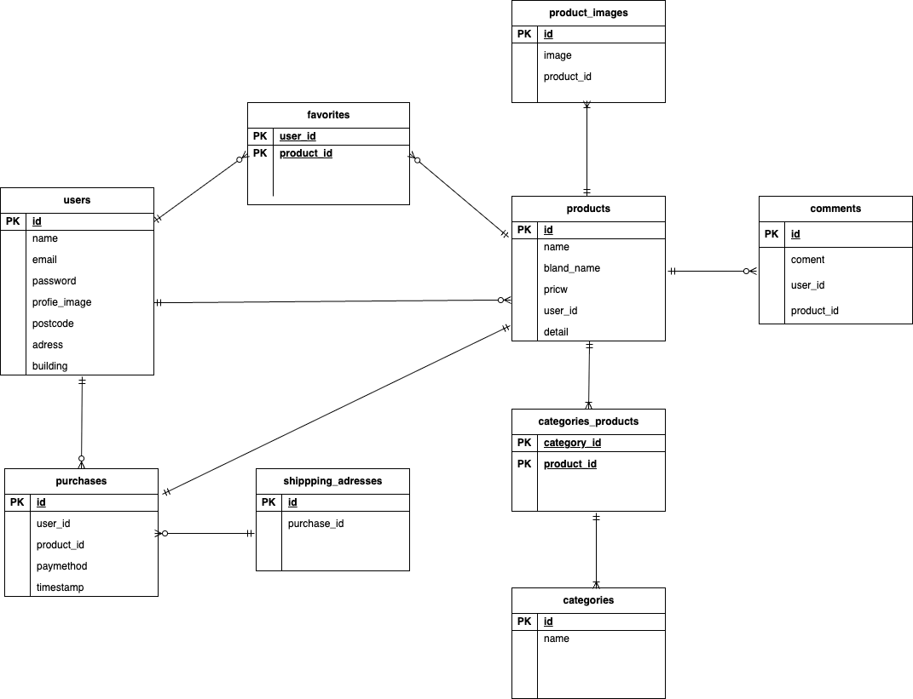

# 　アプリ名：flea-market
```bash
##　　環境構築
##　Dockerビルド
　　・git clone git@github.com:Estra-Coachtech/laravel-docker-template.git
　　・docker-compose up -d --build

##　laravel環境構築
   ・docker-compose exec php bash
   ・composer install
   ・cp .env.example .env　　環境変数を変更
   ・php artisan key:generate
   ・php artisan migrate


##　　使用技術
・PHP 8.x
・Laravel 8.x
・MySQL 8.0
・nginx 1.21.1
```
##　　ER図

