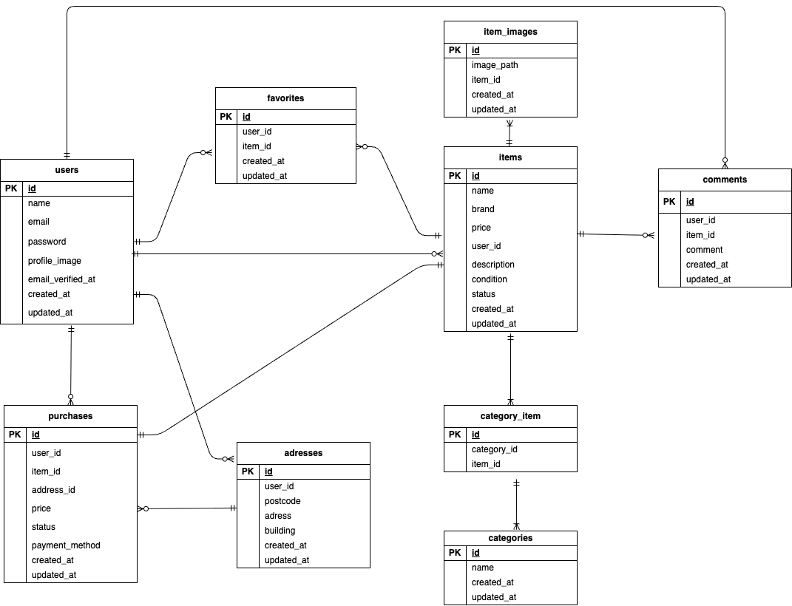

# 　アプリ名：flea-market

##　　環境構築

##　Dockerビルド

```bash
git clone　git@github.com:aokiaiko/flea-market.git
docker-compose up -d --build
```

##　laravel環境構築

```bash
docker-compose exec php bash
composer install
cp .env.example .env　　環境変数を変更
php artisan key:generate
php artisan migrate
php artisan db:seed
php artisan storage:link
```

## テスト

### テスト用データベース作成

MySQLに `flea_market_test` データベースを作成してください。

```sql
CREATE DATABASE flea_market_test;
```

### テスト実行

```bash
cp .env .env.testing
php artisan key:generate --env=testing
php artisan migrate --env=testing
php artisan test
```

## 決済機能

Stripe（Sandbox環境）を利用しています。Stripeのテストアカウントを作成し、テスト用のシークレットキーを取得してください。取得したキーを`.env`に設定します。
`.env`の`STRIPE_SECRET`にテスト用シークレットキーを設定して下さい。

##　　開発環境

- **アプリ**: http://localhost/
- **ユーザー登録**: http://localhost/register
- **phpMyAdmin**: http://localhost:8080/
- **MailHog**：http://localhost:8025/

##　　使用技術

- PHP 8.1
- Laravel 8.83.8
- MySQL 8.0
- nginx 1.21.1

##　　ER図

